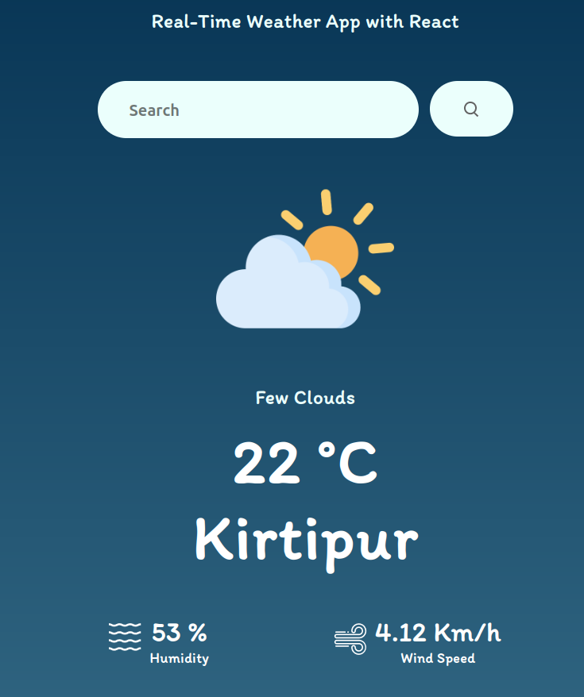

# Real-Time Weather Application

This application is a dynamic weather forecast tool built with React, leveraging the OpenWeatherMap API to provide real-time weather data for any location. It displays essential weather conditions such as temperature, humidity, and wind speed, enhancing user experience with a visually appealing interface.

## Features

- **Real-Time Weather Data:** Fetches and displays current weather conditions for any city.
- **User-Friendly Interface:** A clean and intuitive UI for easy data access.
- **Weather Condition Icons:** Displays appropriate weather condition icons based on the current weather.
- **Search Functionality:** Allows users to search for weather information by city name.

## Prerequisites

- Node.js and npm installed on your machine.
- An API key from OpenWeatherMap. You can obtain one by signing up on their [website](https://openweathermap.org/).

## Contributing

Contributions are welcome!

## License

This project is licensed under the MIT License - see the [LICENSE](LICENSE) file for details.

## Preview
Live Demo - [Weather App](https://weather-app-xi-five-41.vercel.app/).

